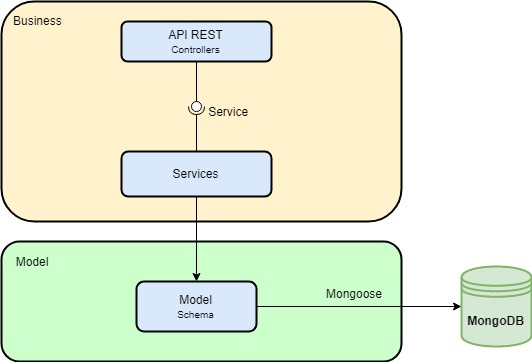

# QConveniente

* A bebida acabou durante uma festa e ninguém pode sair dirigindo para comprar mais
* Óleo ou fósforo acabaram na hora do almoço em pleno domingo e mercearia do seu bairro estava fechada
* Gás ou água acabaram e o único número pendurado na lateral da geladeira não atende

Muito provavelmente você já passou por uma dessas situações, e vamos concordar, é um saco, não é?

Mas imagine se você pudesse resolver qualquer uma dessas situações em alguns cliques, utilizando apenas o seu celular? Também temos que concordar, isso seria bem bacana! Antes você não podia, mas agora você pode!

## QConveniente App

O QConveniente é um aplicativo para trazer as conveniências para bem pertinho de você. Você poderá encontrar os estabelecimentos mais próximos da sua casa e escolher aquele que você achar melhor. Seja bebida, água, gás ou muitas outras opções, você poderá encontrar tudo num lugar só. E o mais legal? No alcance das suas mãos!

## QConveniente Web

O QConveniente também possui um sistema web, para você que é dono de uma conveniência, mercearia, ponto de venda de água/gás, etc. É possível disponibilizar seus produtos para pessoas de diversas regiões da sua cidade ou até de cidades vizinhas! Você poderá gerenciar todas as vendas pelo computador ou até mesmo do seu celular.

# API REST

Este é o repositório que hospeda o código da API REST do QConveniente.

## Mãos à obra

As instruções abaixo lhe permitirão utilizar uma cópia do projeto executando na sua máquina para propósitos de desenvolvimento e teste.

### Pré-requisitos

Para executar o sistema localmente você precisará instalar os seguintes softwares:

- [Node.js](https://nodejs.org/en/)
- [MongoDB](https://docs.mongodb.com/manual/installation/)

### Instalação

- Clone o repositório
```
git clone https://github.com/velmer/qconveniente.git
```
- Instale as dependências
```
cd qconveniente
npm install
```

### Execução

- Inicie seu servidor MongoDB (você precisará fazer isso em outro terminal)
```
mongod
```
- "Builde" e inicie o sistema
```
npm run build
npm start
```

Finalmente, navegue em `http://localhost:3000` e veja que o nosso servidor já está *up and running*!

## Executando os Testes

`npm run test` vai dar conta do recado.

# Especificação

Todas as regras de negócios e casos de uso do QConveniente estão disponíveis em sua [especificação](ESPECIFICADAO.md).

# Arquitetura

<p align="center">
  
</p>

A nossa API REST é construída em cima de uma arquitetura de 3 Camadas.

A camada inicial é o *entry point* do sistema, sendo composta pelos controllers de cada um dos recursos do sistema. Um controller é responsável por receber a requisição HTTP feita pelo cliente à nossa API, extrair os dados da mesma e repassá-los para a próxima camada.

A segunda camada é a camada dos services, os quais são responsáveis pela lógica de negócio do sistema. Um service deve fazer as validações necessárias para que uma requisição feita ao mesmo seja continuada caso seja válida ou seja interrompida caso contrário. Uma vez que a requisição seja validada, o service deverá repassá-la para a terceira e última camada.

Por fim, a terceira camada é composta pelos models, que são as entidades do nosso sistema. Uma entidade tem como responsabilidade se comunicar com o MongoDB (nosso BD) para realizar as ações necessárias (por exemplo, consultar, salvar, editar, ou excluir uma entidade). Nossos models são Schemas do Mongoose, o qual é o nosso ODM (*Object Data Mapping*), que realizará o trabalho de converter uma entidade do sistema em documento para ser salvo no BD.

# Autenticação

No QConveniente existem alguns recursos que só podem ser acessados mediante autenticação. Para se autenticar no sistema, o usuário deve prover seu nome de usuário e senha. Caso ambos estejam corretos, será retornado um token JWT, o qual deverá ser enviado nas requisições seguintes que necessitarem de autenticação.

## License
Copyright (c) Microsoft Corporation. All rights reserved. Licensed under the [MIT](LICENSE.txt) License.
