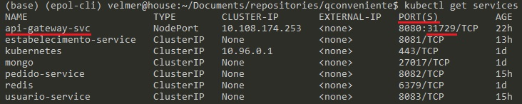
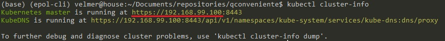
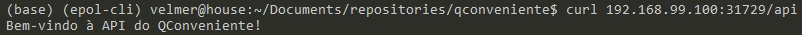
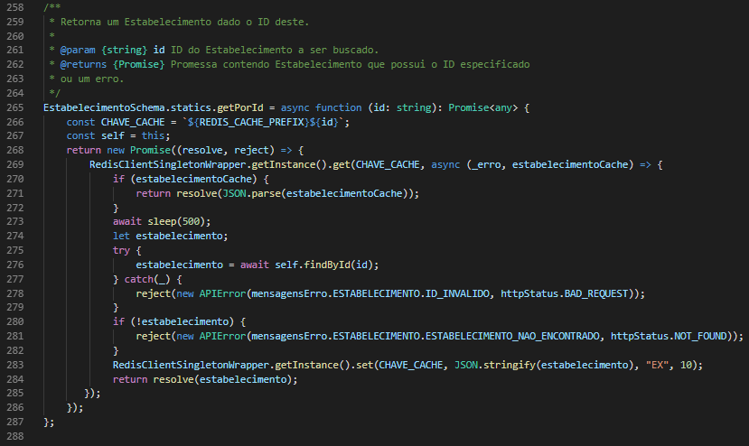

# QConveniente

* A bebida acabou durante uma festa e ninguém pode sair dirigindo para comprar mais
* Óleo ou fósforo acabaram na hora do almoço em pleno domingo e mercearia do seu bairro estava fechada
* Gás ou água acabaram e o único número pendurado na lateral da geladeira não atende

Muito provavelmente você já passou por uma dessas situações, e vamos concordar, é um saco, não é?

Mas imagine se você pudesse resolver qualquer uma dessas situações em alguns cliques, utilizando apenas o seu celular? Também temos que concordar, isso seria bem bacana! Antes você não podia, mas agora você pode!

## QConveniente App

O QConveniente é um aplicativo para trazer as conveniências para bem pertinho de você. Você poderá encontrar os estabelecimentos mais próximos da sua casa e escolher aquele que você achar melhor. Seja bebida, água, gás ou muitas outras opções, você poderá encontrar tudo num lugar só. E o mais legal? No alcance das suas mãos!

## QConveniente Web

O QConveniente também possui um sistema web, para você que é dono de uma conveniência, mercearia, ponto de venda de água/gás, etc. É possível disponibilizar seus produtos para pessoas de diversas regiões da sua cidade ou até de cidades vizinhas! Você poderá gerenciar todas as vendas pelo computador ou até mesmo do seu celular.

# API REST

Este é o repositório que hospeda o código da API REST do QConveniente.

## Mãos à obra

As instruções abaixo lhe permitirão utilizar uma cópia do projeto executando na sua máquina para propósitos de desenvolvimento e teste.

### Pré-requisitos

Para executar o sistema localmente você precisará instalar os seguintes softwares:

- [Node.js](https://nodejs.org/en/)
- [MongoDB](https://docs.mongodb.com/manual/installation/)

### Instalação

- Clone o repositório
```
git clone https://github.com/velmer/qconveniente.git
```
- Instale as dependências
```
cd qconveniente
npm install
```

### Execução local

- Inicie seu servidor MongoDB (você precisará fazer isso em outro terminal)
```
mongod
```
- "Builde" e inicie o sistema
```
npm run build
npm start
```

Finalmente, navegue em `http://localhost:3000` e veja que o nosso servidor já está *up and running*!

## Executando os Testes

`npm run test` vai dar conta do recado.

# Especificação

Todas as regras de negócios e casos de uso do QConveniente estão disponíveis em sua [especificação](ESPECIFICADAO.md).

# Arquitetura

O QConveniente é estruturado em Microservices, possuindo um API Gateway que serve como porta de entrada pro sistema.

O `Estabelecimento Service` é responsável por todas as operações com a entidade Estabelecimento e seus Produtos. O `Pedido Service` é responsável pelo gerenciamento dos pedidos realizados, desde sua criação em rascunho até a entrega ser realizada. O `Usuario Service` é responsável pelas operações com a entidade Usuário, assim como a autenticação do sistema.

Além disso, temos os microservices responsáveis pela interação com os bancos de dados. O `Mongo Service` é responsável por se comunicar com o MongoDB que serve os três microservices acima. Por fim, o `Redis Service` é responsável por se comunicar com o Redis que serve para armazenar o cache da aplicação, que atualmente é utilizado apenas pelo `Estabelecimento Service`.

<p align="center">
  
</p>

## Arquitetura dos Microservices

<p align="center">
  
</p>

A nossa API REST é construída em cima de uma arquitetura de 3 Camadas.

A camada inicial é o *entry point* do sistema, sendo composta pelos controllers de cada um dos recursos do sistema. Um controller é responsável por receber a requisição HTTP feita pelo cliente à nossa API, extrair os dados da mesma e repassá-los para a próxima camada.

A segunda camada é a camada dos services, os quais são responsáveis pela lógica de negócio do sistema. Um service deve fazer as validações necessárias para que uma requisição feita ao mesmo seja continuada caso seja válida ou seja interrompida caso contrário. Uma vez que a requisição seja validada, o service deverá repassá-la para a terceira e última camada.

Por fim, a terceira camada é composta pelos models, que são as entidades do nosso sistema. Uma entidade tem como responsabilidade se comunicar com o MongoDB (nosso BD) para realizar as ações necessárias (por exemplo, consultar, salvar, editar, ou excluir uma entidade). Nossos models são Schemas do Mongoose, o qual é o nosso ODM (*Object Data Mapping*), que realizará o trabalho de converter uma entidade do sistema em documento para ser salvo no BD.

## Deploy no Kubernetes

O QConveniente suporta deployment no Kubernetes. Para tal, cada um dos serviços tem seus arquivos de configuração de `deployment` e exposição via `service`. Como desejamos que o usuário acesse nossa API apenas pelo Gateway da mesma, o `API Service` é o único serviço externalizado do nosso deploy, sendo um `service` do tipo `NodePort`, enquanto os demais são do tipo `ClusterIP`. Os arquivos de configuração de cada um dos microservices estão na pasta `/k8s`.

### Minikube

Para realizar o deploy localmente, podemos utilizar o Minikube, o qual irá criar um cluster Kubernetes com apenas um node, onde estarão localizados todos os pods criados. Nesse sentido, precisamos inicializar o Minikube, faremos isso com o seguinte comando:

```
minikube start
```

### Kubectl

Para gerenciar nosso cluster utilizaremos o Kubectl, o gerenciador do Kubernetes. Com o Minikube inicializado e com as imagens dos microservices configuradas via Docker, podemos iniciar nosso cluster. Para tal, executamos os seguintes comandos:

- Criar o deploy/pod para cada um dos services:
```
kubectl apply -f diretorio-do-service/k8s/arquivo-de-deployment-do-service.yaml
```

- Expor cada pod como um `service` do Kubernetes:
```
kubectl apply -f diretorio-do-service/k8s/arquivo-de-service-do-service.yaml
```

Com isso, todos os serviços estarão deployados e em execução. Para acessar a API, precisamos descobrir em qual porta o service do `API Gateway` está executando. Para tal, rodamos o comando `kubectl get services` e encontramos a porta na coluna `PORT(S)` no formato `portaInterna:portaExterna/protocolo`, assim utilizaremos a `portaExterna`, já que desejamos acessar o `service` de fora do cluster.

<p align="center">
  
</p>

Além disso, precisamos saber qual o IP público (host) do nosso cluster, para tal executamos o comando `kubectl cluster-info`.

<p align="center">
  
</p>

Com o IP e a Porta já podemos realizar requisições à nossa API, assim como mostra a figura abaixo. Para realizar o acesso, usamos o comando `curl` e executamos um GET em `/api` que é a rota default do API Gateway.

<p align="center">
  
</p>

# Autenticação

No QConveniente existem alguns recursos e rotas que só podem ser acessados mediante autenticação. Nossa autenticação é feita utilizando JWT, ou seja, utilizamos tokens para autenticar um determinado usuário. Quando um usuário se cadastra no sistema ele provê informações, dentre as quais estão um nome de usuário e uma senha, os quais são suas credenciais e serão utilizados para autenticá-lo.

Caso as credenciais estejam corretas, ou seja, existe um usuário com o nome de usuário fornecido e esse tem a senha fornecida, o usuário é autenticado e receberá um token (JWT). Esse token poderá ser enviando no header `Authorization` de requisições que necessitem de autenticação no formato `"Bearer seuToken"`.

Caso as credenciais estejam incorretas, seja por não existir um usuário com o nome de usuário fornecido ou por a senha fornecida não bater com a senha cadastrada, será retornado um erro 401 `Unauthorized`.

## Usuário

Para um usuário do App poder se autenticar será necessário enviar suas credenciais para a rota de autenticação. Esse envio deve ser feito através de um POST.

```
POST /auth/login

body: {
  "nomeUsuario": "seuNomeDeUsuarioAqui",
  "senha": "suaSenhaAqui"
}
```

O token retornado para o usuário terá como Payload um campo `idUsuario`, o qual será, obviamente, o ID do usuário que se autenticou.

# Escala

Node.js executa utilizando apenas um core do processador da máquina, mesmo ela possuindo mais cores disponíveis. Nesse sentido, poderíamos aumentar a escala da nossa aplicação caso utilizássemos todos os cores disponíveis na CPU. O Node.js provê um módulo `Cluster`, o qual permite aumentar a escala da sua aplicação, porém para utilizá-lo precisamos manipular as instâncias criadas na mão, realizando *forks* a partir do cluster principal para criá-las, por exemplo, dentro do código da nossa aplicação. Portanto, seria interessante realizar clusterização, mas não ter que lidar com detalhes minuciosos da sua implementação. Dessa forma, vamos utilizar o PM2, um gerenciador de processos com um balanceador de carga embutido (*built-in*), o qual utiliza por baixo o módulo `Cluster` do Node.js.

A vantagem de utilizar o PM2 é que o código da aplicação mantém-se o mesmo, nós só precisamos criar um arquivo de configuração que o PM2 utilizará para criar e gerenciar nossas instâncias. Para acessar nosso arquivo de configuração clique [aqui](ecosystem.config.ts).

# Desempenho

Além de aumentar a escala da nossa aplicação, melhorando a quantidade de requisições que a mesma consegue atender, nós podemos responder cada uma dessas requisições mais rapidamente, melhorando agora o desempenho da nossa aplicação. Para tal, nós utilizaremos cache na nossa camada `Model` do nosso sistema, a qual é a camada que acessa o nosso banco de dados MongoDB. O acesso ao BD é lento - acessa o disco rígido -, aumentando a latência das respostas aos clientes, por isso iremos "cachear" tais acessos.

Poderíamos implementar nosso próprio cache dentro da aplicação, mas isso aumentaria a complexidade da mesma consideravelmente, visto que precisariámos implementar também as políticas de acesso ao cache, políticas de substituição de entradas quando o cache atingisse sua capacidade máxima, entre outras políticas e regras. Além disso, estaríamos criando um cache para cada instância da aplicação, ou seja, não poderíamos usufruir da clusterização feita pelo PM2. Para usufruir da clusterização, necessitamos utilizar um cache externo a nossa aplicação, um cache que seja distribuído.

Nesse sentido, utilizaremos o Redis, um banco de dados chave-valor **em memória**, como cache. Dessa forma, nós conseguimos configurar e executar o Redis independente da nossa aplicação, utilizando-o de maneira distribuída, sem precisar se preocupar com que instância Node.js da nossa aplicação está sendo requisitada.

## Fazendo cache da busca de Estabelecimentos

## Fluxo de execução sem cache

Sem cache, tudo que é necessário fazer é buscar o Estabelecimento pelo seu ID e tratar os casos de erro, que são o de ID inválido e o do Estabelecimento não existir no BD.

<p align="center">
  
  <p align="center">Estabelecimento.getPorId SEM Cache</p>
</p>


## Fluxo de execução com cache

Com cache, agora precisamos acessar o Redis e buscar a chave que pode ter o Estabelecimento em questão como valor. Essa chave é formada da seguinte forma: "estabelecimento-IdDoEstabelecimento".

Em seguida, verificamos se o Estabelecimento recuperado do cache existe, caso exista, nós podemos retorná-lo como JSON. Caso contrário, será necessário buscá-lo no banco de dados (adicionando uma espera de 0,5 segundos como solicitado).

Por fim, recuperando o Estabelecimento com sucesso do banco, para que em uma próxima requisição o cache possa ser utilizado, inserimos o Estabelecimento recuperado no cache como string utilizando `JSON.stringfy`.

<p align="center">
  
  <p align="center">Estabelecimento.getPorId COM Cache</p>
</p>

## Teste de Desempenho

Para testar e comprovar a melhora no desempenho da nossa aplicação, realizei um teste de desempenho que durou 30s com um total de 100 mil requisições. O mesmo teste foi realizado com o sistema não utilizando e em seguida utilizando o cache.

Sem o cache, o servidor conseguiu responder 99949 das 100 mil requisições realizadas, tendo 51 delas retornando timeout. Já com o cache, o servidor conseguiu responder sem problemas todas as 100 mil requisições.

|    Tipo    | Duração | Requisições respondidas | Tempo Mínimo Resposta | Tempo Médio Resposta | Tempo Máximo Resposta |
| ---------- | ------- | ----------------------- | --------------------- | -------------------- | --------------------- |
| Sem Cache  |  170s   |         99949           | 0.543s | 1.568s | 67.3s | 
| Com Cache  |  130s   |         100000          | 0.21s | 0.27s | 1,5s |


Para mais detalhes:
- [Resultados sem cache](\load_test_reports\teste-sem-cache.html)
- [Resultados com cache](\load_test_reports\teste-com-cache.html)

## License
Copyright (c) Microsoft Corporation. All rights reserved. Licensed under the [MIT](LICENSE.txt) License.
